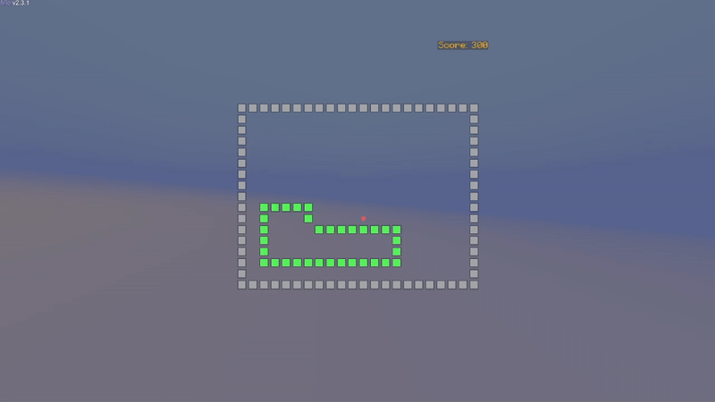

# SnakeGame

Classic snake game rendered in Minecraft using text display entities.

## Requirements

- Minecraft server 1.21.1+
- Paper or compatible fork (Purpur, Pufferfish, etc.)
- [PacketEvents](https://modrinth.com/plugin/packetevents) (must be installed)

## Usage

Start a game with `/snakegame` or `/snake`

**Controls:**
- W/A/S/D - Move the snake
- Shift - Exit game

## Technical Details

- [PacketEvents](https://github.com/retrooper/packetevents) - packet manipulation and camera control
- [EntityLib](https://github.com/Tofaa2/EntityLib) - text display entity management  
- No server-side entities - everything rendered client-side via packets

## Configuration

Currently hardcoded. Configuration system planned for future release.

## License

MIT
